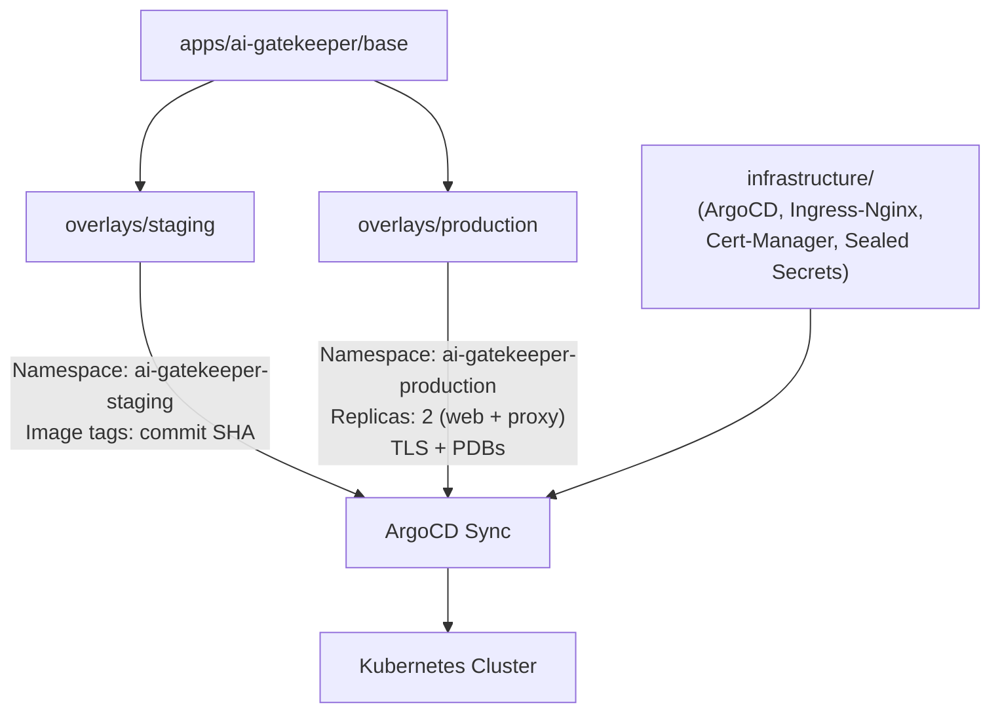
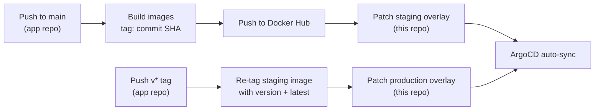

# AI-Gatekeeper GitOps

**Kubernetes manifests, Kustomize overlays, and ArgoCD configuration for the AI-Gatekeeper platform.**


> 📦 **Application source code, Dockerfiles, and CI pipelines live in the companion repo → [AI-Gatekeeper](https://github.com/jklanica/AI-Gatekeeper)**

---

## Overview

This repository is the **single source of truth** for everything running in the Kubernetes cluster. ArgoCD watches this repo and continuously reconciles the cluster state to match what is committed here.

The application repo contains no Kubernetes manifests — it only builds and pushes Docker images. CI in that repo then patches the image tags in this repo's Kustomize overlays, triggering ArgoCD to sync.

---

## Repository Structure

```
ai-gatekeeper-gitops/
├── clusters/
│   └── production/
│       ├── kustomization.yaml          # Cluster entrypoint — composes all layers
│       └── root-application.yaml       # ArgoCD root Application (self-managing)
├── apps/
│   └── ai-gatekeeper/
│       ├── base/                       # Shared manifests for all environments
│       │   ├── config/                 # ConfigMap + SealedSecret
│       │   ├── postgres/               # StatefulSet + Service + PVC
│       │   ├── redis/                  # Deployment + Service
│       │   ├── migrator/               # Job (schema migrations)
│       │   ├── proxy/                  # Deployment + Service
│       │   ├── web/                    # Deployment + Service
│       │   ├── ingress/                # Ingress rules (/v1 → proxy, / → web)
│       │   └── network-policies/       # Default-deny + per-service allow rules
│       └── overlays/
│           ├── staging/                # Namespace override + image tags (SHA)
│           └── production/             # TLS, replicas (×2), PodDisruptionBudgets
└── infrastructure/
    ├── controllers/
    │   ├── argocd/                     # ArgoCD Helm chart (v7.1.1)
    │   └── ingress-nginx/              # Ingress-Nginx Helm chart (v4.10.1)
    └── security/
        ├── cert-manager/               # Cert-Manager Helm chart (v1.14.4) + ClusterIssuer
        └── sealed-secrets/             # Sealed Secrets Helm chart (v2.5.19)
```

---

## Infrastructure Components

| Component          | Purpose                                                                       |
| ------------------ | ----------------------------------------------------------------------------- |
| **ArgoCD**         | GitOps controller — watches this repo and auto-syncs the cluster              |
| **Ingress-Nginx**  | Cluster ingress controller — routes external traffic to services              |
| **Cert-Manager**   | Automated TLS certificate provisioning via a self-signed ClusterIssuer        |
| **Sealed Secrets** | Encrypts Kubernetes Secrets so they can be safely committed to Git            |

All infrastructure is installed via **Kustomize + Helm** (`helmCharts` in kustomization.yaml), pinned to specific chart versions.

---

## Kustomize Layering

The manifests follow a **base → overlay** pattern managed entirely with Kustomize:



### Base

Defines the canonical set of resources shared by all environments: namespace, ConfigMap, SealedSecret, StatefulSet (Postgres), Deployments (proxy, web, Redis), a migration Job, Ingress rules, and NetworkPolicies.

### Staging Overlay

- Overrides namespace to `ai-gatekeeper-staging`
- Sets image tags to the short commit SHA — updated automatically by CI on every push to `main`

### Production Overlay

- Overrides namespace to `ai-gatekeeper-production`
- Scales `web` and `proxy` to **2 replicas** each
- Adds **PodDisruptionBudgets** (`minAvailable: 1`) for both
- Patches Ingress with **TLS termination** via Cert-Manager (`local.ai-gatekeeper.com`)

---

## Network Security

The base layer enforces a **default-deny** network policy — all ingress and egress traffic is blocked unless explicitly allowed. Individual policies then open only the minimum required paths:

| Policy               | Allows                                                   |
| -------------------- | -------------------------------------------------------- |
| **default-deny**     | Blocks all ingress and egress by default                 |
| **dns-allow**        | Egress to kube-dns for DNS resolution                    |
| **ingress-allow**    | Ingress from the Ingress-Nginx controller to web + proxy |
| **web-networkpolicy**    | Web → Postgres, Web → Proxy (tRPC)                  |
| **proxy-networkpolicy**  | Proxy → Postgres, Proxy → Redis, Proxy → internet (LLM APIs) |
| **postgres-networkpolicy** | Accepts connections only from web, proxy, and migrator |
| **redis-networkpolicy**   | Accepts connections only from proxy                  |

---

## Workload Hardening

Every workload in this repo follows production security best practices:

- **Non-root execution** — all pods run as non-root users (`runAsNonRoot: true`)
- **Read-only root filesystem** — containers cannot write to their own filesystem (`readOnlyRootFilesystem: true`)
- **No privilege escalation** — `allowPrivilegeEscalation: false` on all containers
- **Dropped capabilities** — all Linux capabilities are dropped (`drop: [ALL]`)
- **Resource limits** — CPU and memory requests/limits defined for every container
- **Health probes** — liveness and readiness probes configured for proxy, web, and Postgres
- **Persistent storage** — Postgres uses a PVC via `volumeClaimTemplates` (StatefulSet)

---

## Deployment Pipeline

This repo is not deployed manually — it is updated automatically by CI in the [application repo](https://github.com/jklanica/AI-Gatekeeper):



**Staging** — CI builds images tagged with the commit SHA, pushes them, then runs `kustomize edit set image` against the staging overlay and commits directly to this repo.

**Production** — A `v*` tag in the app repo pulls the exact staging image by SHA, re-tags it with the version and `latest`, then patches the production overlay. No rebuild.

---

## Running Locally

To deploy the full stack on a local Kubernetes cluster (e.g., Docker Desktop):

### 1. Restore Sealed Secrets Master Key

Sealed Secrets encrypts data with a cluster-specific master key. If the cluster was reset, the old key is gone and the committed `sealed-secret.yaml` will not decrypt. Restore the backed-up key first:

```bash
# Deploy the Sealed Secrets controller
kustomize build --enable-helm infrastructure/security/sealed-secrets/base | kubectl apply -f -

# Restore the master key (never committed — kept offline)
kubectl apply -f master-key.backup.yaml

# Restart the controller to pick up the restored key
kubectl rollout restart deployment -n sealed-secrets sealed-secrets
```

> **First-time setup?** Generate a new secret from `secret.template.yaml`, encrypt it with `kubeseal`, and back up the master key the cluster generates.

### 2. Deploy the Cluster

```bash
kustomize build --enable-helm clusters/production | kubectl apply -f -
```

Or let ArgoCD manage itself:

```bash
kubectl apply -f clusters/production/root-application.yaml
```

### 3. Configure Local DNS

The Ingress expects the hostname `local.ai-gatekeeper.com`. Add it to `/etc/hosts`:

```
127.0.0.1 local.ai-gatekeeper.com
```

### 4. Access the Application

Navigate to `https://local.ai-gatekeeper.com`.

> The production overlay uses a self-signed certificate. Your browser will show a security warning — click through to proceed.

---

## Related

| Repository                                                               | Description                                                    |
| ------------------------------------------------------------------------ | -------------------------------------------------------------- |
| [AI-Gatekeeper](https://github.com/jklanica/AI-Gatekeeper)               | Application source code, Dockerfiles, CI pipelines             |
| [AI-Gatekeeper-gitops](https://github.com/jklanica/AI-Gatekeeper-gitops) | Kubernetes manifests, Kustomize overlays, ArgoCD config (this repo) |

---

## License

Licensed under the [Apache License 2.0](./LICENSE).
